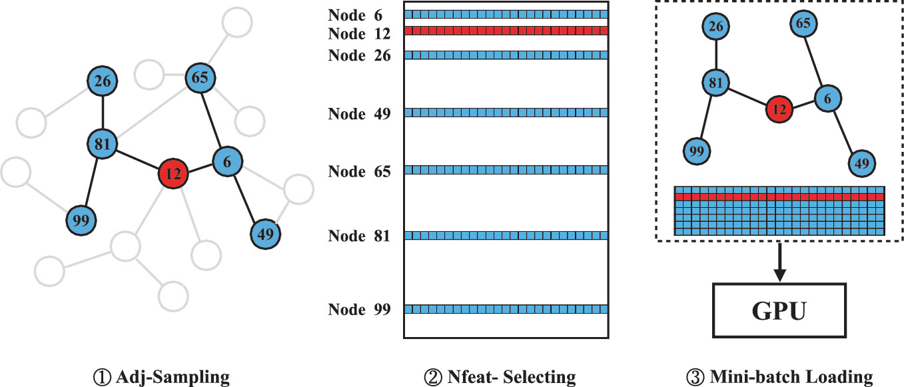
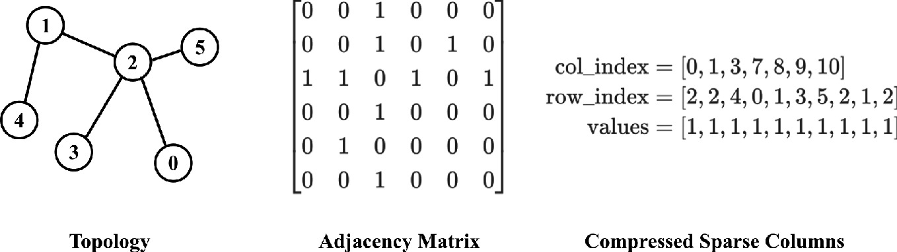
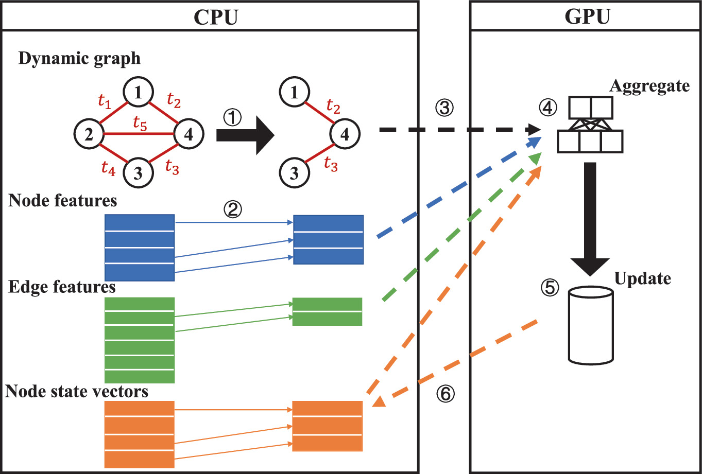
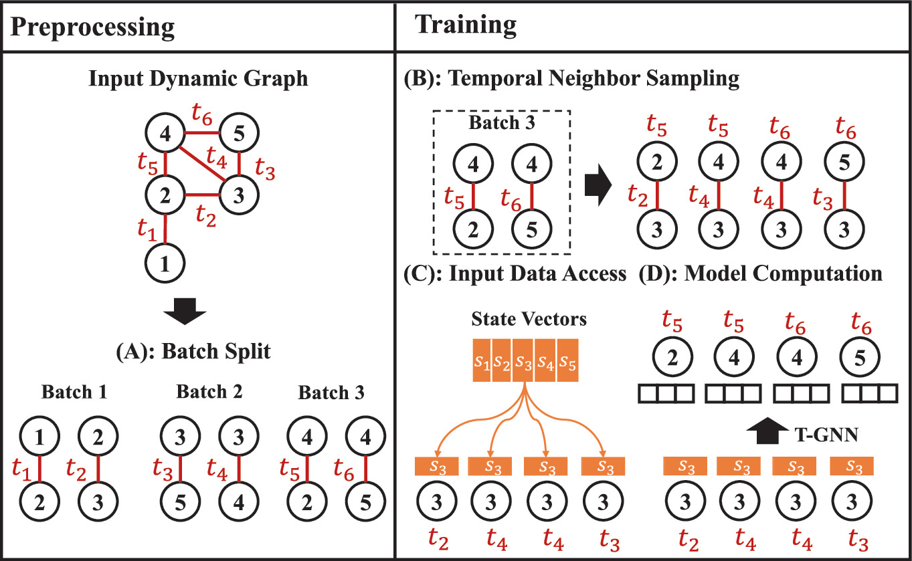

# Preliminary Foundational Concepts for GNNs

## Common Definitions

#### Graph

A graph is defined as a tuple $G = (V, E)$, where $V = \{v_1, v_2, \dots, v_N\}$ denotes the set of $N$ nodes, and $E = \{e_1, e_2, \dots, e_M\}$ denotes the set of $M$ edges connecting pairs of nodes, typically with $e = (v_i, v_j)$ representing an edge from node $v_i$ to node $v_j$. Graphs can be directed or undirected and are often equivalently represented using an adjacency matrix.

#### Node/Edge Features

Each node or edge can be associated with an attribute vector to describe its characteristics. Node features are usually represented as a matrix $X_V \in \mathbb{R}^{N \times d}$, where each node has a $d$-dimensional feature vector, and edge features are represented as $X_E \in \mathbb{R}^{M \times d}$. For instance, in social networks, node features may represent user profiles, while edge features may encode communication frequency or relationship types.

#### Message Passing Mechanism

The core computational process of GNNs typically involves a message passing (or neighborhood aggregation) mechanism. Each target node aggregates messages (i.e., features) from its neighbors and updates its own representation using a learnable aggregation function. Formally, in a two-layer GNN, the feature update at node $v$ can be approximated as:

$$h_v^{(k)} = \sigma \left( W^{(k)} \cdot \text{AGG}\left( \{ h_u^{(k-1)} : u \in \mathcal{N}(v) \} \right) + b^{(k)}\right) \tag{2.1}$$

  where $\mathcal{N}(v)$ denotes the set of neighbors of node $v$, $\text{AGG}$ is the aggregation function (e.g., mean, weighted sum, attention mechanism), $\sigma$ is a nonlinear activation function, and $W^{(k)}, b^{(k)}$ are learnable parameters at the $k$-th layer.

#### Training Process and Computation Graph

The training of GNNs is analogous to that of traditional neural networks, including forward propagation, loss computation, and gradient-based backpropagation. A key difference lies in the dynamic construction of computation graphs per iteration. For each target node, a computation subgraph is formed by retrieving its $K$-hop neighbors, akin to unfolding the graph into a tree. Multi-layer aggregation is then performed on this subgraph, followed by loss calculation and parameter updates.

#### Sampling

Real-world graphs are often large-scale, making it impractical to process the entire graph per batch. To address this, training systems typically adopt sampling strategies: from a set of target nodes, a fixed number of neighbors are sampled (either randomly or via importance) to construct subgraphs for training. Sampling significantly reduces per-batch computation and memory usage.

#### Neighbor Aggregation

This refers to the process by which a target node collects information from its neighbors, typically involving a linear transformation followed by summation, averaging, or attention-weighted aggregation. For example, GCN uses symmetric normalization of the adjacency matrix for convolution, while GAT assigns learnable attention weights to neighbors. The choice of aggregation function directly impacts the model’s expressiveness and computational efficiency.

#### Memory Management

GNN training is memory-intensive, especially on large graphs with high-degree nodes. Common memory optimization techniques include layer-wise sampling or subgraph sampling to reduce per-iteration memory load, as well as asynchronous I/O and memory caching strategies to reuse intermediate results. These will be discussed in detail for single-GPU and multi-GPU scenarios in subsequent sections.

## GNNs on Static Graphs

### Full Graph Training

We define a graph structure as $\mathcal{G}=(\mathcal{V},\mathcal{E})$, comprising a set of $N$ nodes $\mathcal{V}=\left\{ v_1, \dots , v_N \right\}$ and a corresponding set of edges $\mathcal{E} \subseteq \mathcal{V} \times \mathcal{V}$. The topological connections are represented by a symmetric adjacency matrix $\textbf{A}$, where each entry $A_{ij}=1$ indicates an edge between nodes $v_i$ and $v_j$, and $A_{ij}=0$ otherwise. To facilitate effective message passing, widely used models like GCN utilize a symmetrically normalized adjacency matrix $\hat{\textbf{A}}=\bar{\textbf{D}}^{-\frac{1}{2}}\bar{\textbf{A}}\bar{\textbf{D}}^{-\frac{1}{2}}$. Here, $\bar{\textbf{A}}=\textbf{A}+\textbf{I}_N$ incorporates self-loops for each node, and $\bar{\textbf{D}} \in \mathbb{R}^{N \times N}$ represents the diagonal degree matrix derived from $\bar{\textbf{A}}$.

From a matrix operations perspective, the feature propagation at the $\ell$-th layer of a GNN can be generalized as:

$$\textbf{H}^{(\ell)}=\sigma \left( \textbf{H}^{(\ell -1)}, \hat{\textbf{A}}; \textbf{W}^{(\ell -1)} \right) \tag{2.2}$$

In this formulation, $\textbf{H}^{(0)}=\textbf{X} \in \mathbb{R}^{N \times F}$ serves as the initial input, where each row corresponds to the feature vector of node $v_i$. The term $\textbf{W} \in \mathbb{R}^{F \times F}$ denotes the learnable weight matrix, and $\sigma$ represents a nonlinear activation function (e.g., ReLU). Note that we omit the superscript $^{(\ell)}$ when the context implies a specific layer. The training process involves two distinct phases:

#### Forward Phase

During the forward pass, the model aggregates neighbor information and applies a linear transformation. This computational flow is mathematically expressed as:

$$\textbf{Z}^{(\ell)} = \hat{\textbf{A}}\textbf{H}^{(\ell -1)}\textbf{W}^{(\ell -1)} \tag{2.3}$$

$$\textbf{H}^{(\ell)} = \sigma \left( \textbf{Z}^{(\ell)} \right) \tag{2.4}$$

#### Backward Phase

The gradients are computed recursively via the chain rule to update the model parameters. Let $\delta^{(\ell)}=\nabla_{\textbf{Z}^{(\ell)}} \mathcal{L}$ be the error term with respect to the intermediate representation $\textbf{Z}^{(\ell)}$ given the loss function $\mathcal{L}$. The recurrence relation for error propagation is derived as:

$$\delta^{(\ell -1)} = \frac{\partial \mathcal{L}}{\partial \textbf{Z}^{(\ell -1)}} = \delta^{(\ell)}\hat{\textbf{A}}\left( \textbf{W}^{(\ell -1)}\right)^\top \odot \sigma^\prime \left( \textbf{Z}^{(\ell -1)}\right) \tag{2.5}$$

  where $\sigma^\prime (\cdot)$ indicates the derivative of the activation function. Consequently, the gradient for the weight matrix $\textbf{W}^{(\ell -1)}$ is calculated by:

$$\nabla_{\textbf{W}^{(\ell -1)}} \mathcal{L} = \frac{\partial \mathcal{L}}{\partial \textbf{W}^{(\ell -1)}} = \delta^{(\ell)}\hat{\textbf{A}}\left( \textbf{H}^{(\ell -1)}\right)^\top \tag{2.6}$$

A complete training *epoch* comprises these forward and backward passes, concluding with the parameter optimization step using a learning rate $\eta$:

$$\textbf{W}^{(\ell -1)} \leftarrow \textbf{W}^{(\ell -1)}-\eta \nabla_{\textbf{W}^{(\ell -1)}} \mathcal{L} \tag{2.7}$$

The training iterates until model convergence is achieved. While the formulation above adopts a matrix-centric view typical for full-batch training, modern approaches often interpret this process through the lens of message passing, particularly when dealing with sophisticated GNN architectures or sampling-based training strategies

### Mini-Batch Training

  1. **Adj-Sampling (Structure Sampling)**: The system recursively traverses the graph structure. Starting from the target node 12, it accesses the adjacency list to randomly select neighbors (e.g., nodes 6 and 81), and repeats this process for the subsequent layer. This phase is characterized by random, fine-grained memory accesses as the sampler chases pointers through the graph topology.
  2. **Nfeat-Selecting (Feature Extraction)**: Once the computation subgraph is determined, the system collects the indices of all involved nodes. It then executes a bulk retrieval operation to fetch the corresponding feature vectors. In contrast to the scattered access pattern of graph sampling, feature extraction typically allows for more compact and high-throughput memory operations.
  Upon completion, the sampled structure and the gathered features are packaged into a mini-batch. The model then proceeds to compute the loss for node 12, execute backpropagation, and update the weights.
  3. **Node-Wise Sampling**: Node-wise sampling focuses on sampling a subset of neighbors for each node during the aggregation process. This approach reduces the computational cost by limiting the number of neighbors considered at each layer.For each node, a fixed number of neighbors, which are usually referred to as fanouts, are randomly sampled at each layer.
  4. **Layer-Wise Sampling**: Layer-wise sampling differs from node-wise sampling by posing sampling limitations to each layer independently. This approach ensures that the number of sampled nodes are consistent across layers, avoiding the exponential growth with respect to the model depths. The sampling process is depicted as follows. At each layer, a subset of nodes is sampled independently considering factors such as variance, connectivity, and contribution to loss. The aggregation is performed only over the paths connecting sampled nodes across different layers, ensuring consistency of training. The representative works of layer-wise sampling are FastGCN and LADIES.
  5. **Subgraph-Wise Sampling**: Subgraph-wise sampling involves sampling entire subgraphs from the original graph and performing computations only on the sampled subgraphs. This approach is particularly effective for mini-batch training. The detail of sampling process is presented as follows. Given the original graph, we extract only a subgraph from it, typically by selecting a subset of nodes and their associated edges. The GNN is trained on the sampled subgraph instead of the original graph, reducing the computational cost. Representatives of this sampling approach include ClusterGCN and GraphSAINT.

Here we present the overall comparison of the three mainstream sampling style and related methods. In summary, node-wise, layer-wise, and subgraph-wise sampling are effective strategies for scaling GNNs to large graphs. All these methods aim to reduce the computational cost of GNN training by sampling a subset of the graph. The node-wise sampling limits a fixed number neighbors for each target node at each layer, but suffers from the “neighborhood explosion” problem for deep GNN models. The layer-wise sampling addresses the “neighborhood explosion” problem by limiting the total number of sampled nodes at each layer, but encounters high sampling costs and certain lost of structure information. Subgraph-wise sampling preserves more local structure information and can avoid the expensive layer-wise sampling cost as well as the neihgbor explosion problem.From the granularity perspective, node-wise sampling operates at the node level, layer-wise sampling at the layer level, and subgraph-wise sampling at the graph level. From the sampling overhead perspective, node-wise sampling has the lowest overhead, while layer-wise and subgraph-wise sampling may require additional preprocessing overload. The choice of method depends on the specific application, graph size, and desired trade-offs between efficiency and accuracy.

### Common Tasks and Datasets for GNNs

#### Node Classification

  **Target**: To predict the label or category of nodes in a graph based on their features and the graph structure.
  **Example Applications**:  social network analysis, recommendation systems, and bioinformatics
  
#### Link Prediction

  **Target**: To predict the existence of edges (links) between pairs of nodes in a graph.
  **Example Applications**: recommender systems, knowledge graph completion, and social network analysis

#### Graph Classification

  **Target**: To predict the label or property of an entire graph
  **Example Applications**: molecular property prediction, social network analysis, and chemical compound classification

### Sparse Graph Representation and Storage

**Compressed Sparse Column (CSC)**: CSC format, compacts the adjacency matrix into three linear arrays:

- **col_ptr** (col_index): This array serves as an index map. For any given node $v_i$ (where $0≤i<N$), the range $(col\_ ptr[i], col\_ ptr[i+1])$ defines the segment in the subsequent arrays that corresponds to node $v_i$’s connections.
- **row_index**: This array stores the row indices of non-zero elements, effectively listing the source nodes for incoming edges.
- **values**: This optional array holds the edge weights or attributes associated with the connections.

## GNNs on Dynamic Graphs

### Continuous-Time Dynamic Graphs (CTDG)

A CTDG is formalized as a stream of time-stamped interaction events, denoted by $G={α(t_1),α(t_2),⋯}$, ordered such that $t_1≤t_2≤⋯$. Each interaction event is encapsulated by a tuple $α(t)=(v_i,v_j,e_{ij}(t),t)$. Here, $v_i$ and $v_j$ represent the interacting source and destination nodes, respectively. $t$ denotes the precise timestamp of the interaction, and $e_{ij}(t)$ is a feature vector encoding the attributes of this specific temporal edge.

### Temporal Graph Neural Networks (T-GNNs)

#### Node State Update

#### Temporal Message Passing

### Training of Temporal Graph Neural Networks

1. **Sampling**
2. **Gathering**
3. **Transfer**
4. **Compute**
5. **State Update**
6. **Synchronization**

