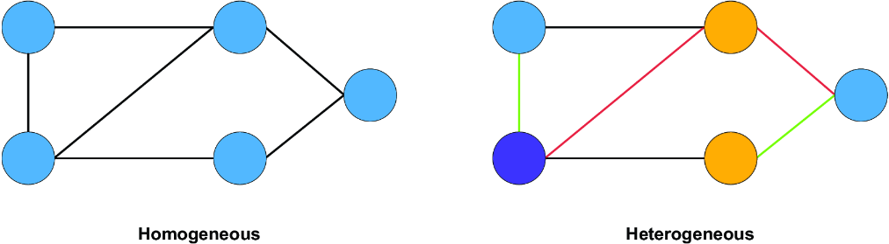
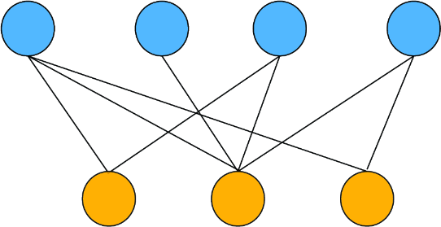
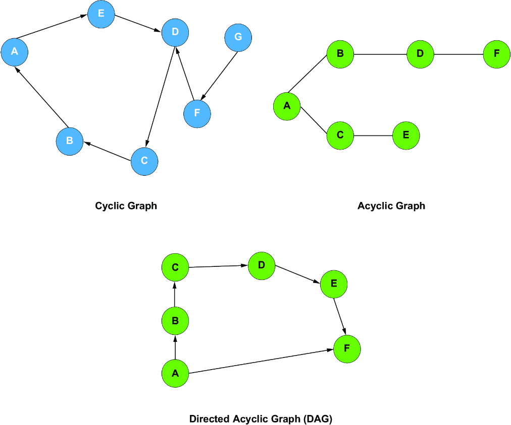
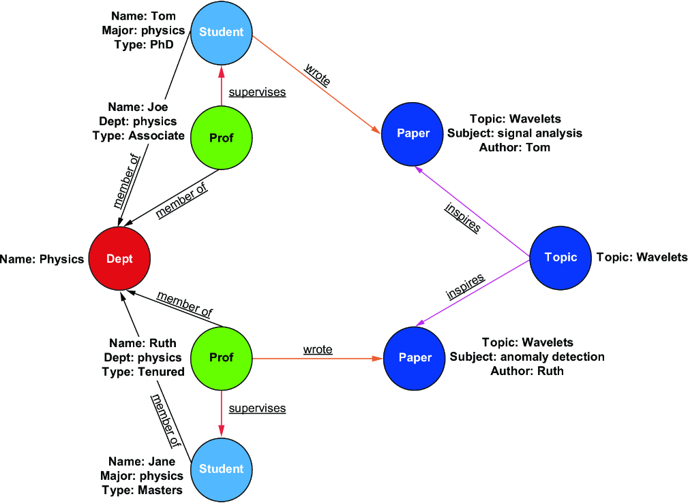
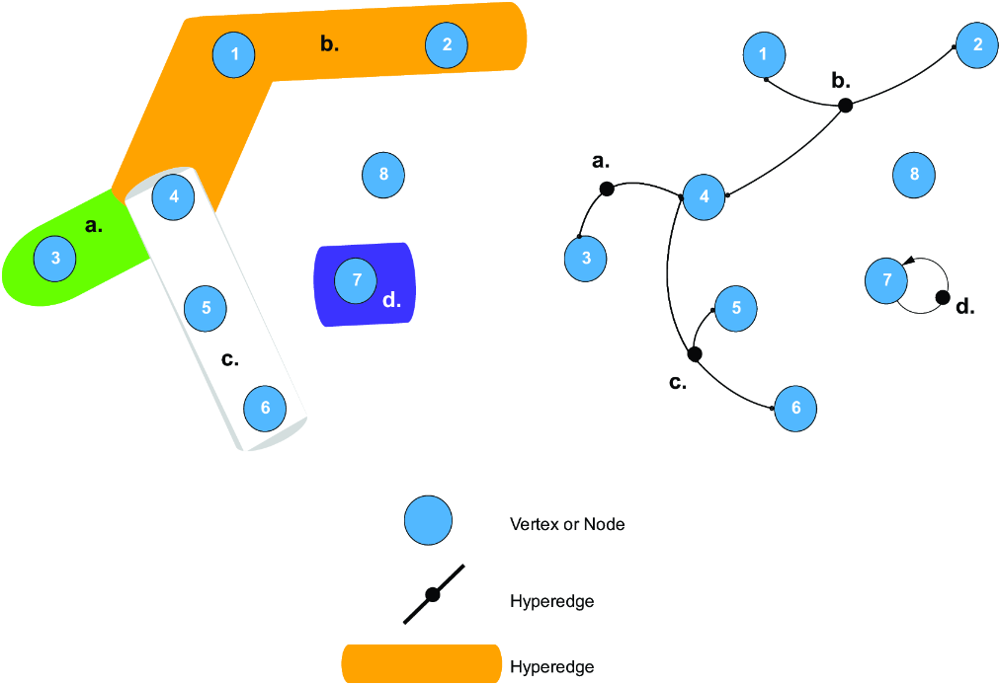

### Different Types of Graphs

- **Homogeneous** Graph: A graph structure restricted to one single uniform type of node and a single uniform type of edge, representing one class of entity and relationship.

- **Heterogeneous** Graph: A multi-modal graph structure containing diverse categories of nodes and/or edges, allowing for the representation of different entity types and complex, multi-layered relationships.

    

- **Bipartite** Graph: is a graph structure where the total set of nodes is partitioned into two distinct, independent sets. Every edge strictly connects a node from the first set to a node in the second set, meaning no connections exist between nodes within the same set.
    

- **Cyclic** Graph: A graph that contains at least one closed path (or loop), meaning you can start at a specific node, follow a sequence of edges, and travel back to that same node without repeating any edges.

- **Acyclic** Graph: A graph that contains absolutely no cycles or loops; it is completely impossible to start at any node and follow a path of edges that leads back to itself.

- **Directed Acyclic** Graph (**DAG**): A graph whose edges have a specific direction (one-way arrows) and contains no cycles, ensuring that if you travel along the directed paths, you can never loop back to a previously visited node.

    - > This characteristic makes DAGs essential in causal analysis, as they reflect causal structures where causality is assumed to be unidirectional. For example, A can cause B, but B can’t simultaneously cause A. This unidirectional nature aligns perfectly with the structure of DAGs, making them ideal for modeling workflow processes, dependency chains, and causal relationships in various fields.

    

- **Knowledge Graph**: A specialized, heterogeneous network structure designed to store real-world facts and complex semantic data. In this graph, nodes represent distinct physical or abstract entities (such as people, places, or concepts), while directed edges represent defined, explicit relationships linking those entities together, typically structured as semantic triples (Subject-Predicate-Object).

    Unlike conventional graphs, which primarily emphasize structure and connectivity, a knowledge graph incorporates metadata and follows specific schemas to provide deeper contextual information. This allows for advanced reasoning and querying capabilities, such as identifying patterns, uncovering specific types of connections, or inferring new relationships.

    
    
    > A key feature of knowledge graphs is their ability to provide explicit context. Unlike conventional heterogeneous graphs, which display different types of entities and their basic connections without detailed semantic meaning, knowledge graphs go further by defining the specific types and meanings of relationships. For example, while a traditional graph might show that Professors are connected to Departments or that Students are linked to Papers, a knowledge graph would specify that Professors supervise Students or that Students and Professors Wrote Papers. This added layer of meaning enables more powerful querying and analysis, making knowledge graphs particularly valuable in fields such as natural language processing, recommendation systems, and academic research analysis.

- **Hypergraph**: A generalized graph structure where an edge (termed a hyperedge) can simultaneously connect any arbitrary number of nodes, rather than being strictly restricted to connecting exactly two nodes as seen in classical graph theory. This structure is uniquely capable of preserving high-order, non-pairwise group relationships without loss of structural information.

    > The complexity of a hypergraph is reflected in its adjacency data. For typical graphs, network connectivity is represented by a two-dimensional adjacency matrix. For hypergraphs, the adjacency matrix extends to a higher dimensional tensor, referred to as an incidence tensor. This tensor is N-dimensional, where N is the maximum number of nodes connected by a single edge.

    

