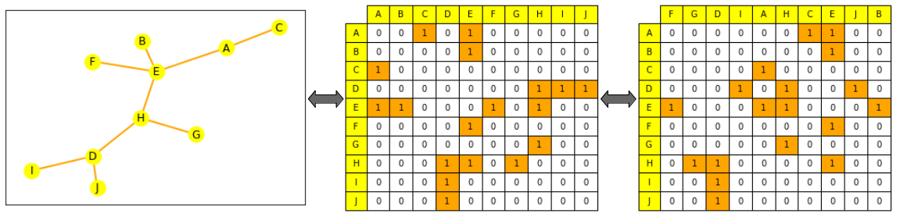

#### predict the evolution a graph

When you want to predict the evolution of a specific graph, you work in a transductive setting, where everything (training, validation, and testing) is done on the same single graph. If this is your setup, be careful! Creating train/eval/test datasets from a single graph is not trivial. However, a lot of the work is done using different graphs (separate train/eval/test splits), which is called an inductive setting.

### How do we represent graphs?

- as the set of all its edges (possibly complemented with the set of all its nodes)
- as the adjacency matrix between all its nodes. An adjacency matrix is a square matrix (of node size * node size) that indicates which nodes are directly connected to which others (where $A_{ij} = 1$ if $n_i$ and $n_j$ are connected, else $0$).  

> most graphs are not densely connected and therefore have sparse adjacency matrices, which can make computations harder.

>> even if they can be represented as lists or matrices, their representation should not be considered an ordered object!  

if you shuffle a graph's edge list or the columns of its adjacency matrix, it is still the same graph.

### Graph representations through ML

The usual process to work on graphs with machine learning is:

1. to generate a meaningful representation for your items of interest (nodes, edges, or full graphs depending on your task)  
2. to use these to train a predictor for your target task. We want (as in other modalities) to constrain the mathematical representations of your objects so that similar objects are mathematically close. However, this similarity is hard to define strictly in graph ML: for example, are two nodes more similar when they have the same labels or the same neighbours?  

### Graph Neural Networks

##### what should a good neural network be to work on graphs?

1. be permutation invariant:  
    Equation:  $f(P(G))=f(G)$  with $f$ the network, $P$ the permutation function, $G$ the graph  
    Explanation: the representation of a graph and its permutations should be the same after going through the network.  
2. be permutation equivariant:
    Equation:  $P(f(G))=f(P(G))$  with $f$ the network, $P$ the permutation function, $G$ the graph
    Explanation: permuting the nodes before passing them to the network should be equivalent to permuting their representations.

Typical neural networks, such as RNNs or CNNs are not permutation invariant. A new architecture, the $Graph Neural Network$, was therefore introduced (initially as a state-based machine).  
A GNN is made of successive layers. A GNN layer represents a node as the combination ($aggregation$) of the representations of its neighbours and itself from the previous layer ($message passing$), plus usually an activation to add some nonlinearity.  

> Comparison to other models:  
    >> A CNN can be seen as a GNN with fixed neighbour sizes (through the sliding window) and ordering (it is not permutation equivariant).  
    >> A Transformer without positional embeddings can be seen as a GNN on a fully-connected input graph.  

#### Aggregation and message passing

There are various methods to aggregate messages from neighbouring nodes, such as summing or averaging.  Some notable works following this idea include:

- $Graph Convolutional Networks$ averages the normalised representation of the neighbours for a node (most GNNs are actually GCNs)  
- $Graph Attention Networks$ learn to weigh the different neighbours based on their importance (like transformers)  
- $GraphSAGE$ samples neighbours at different hops before aggregating their information in several steps with max pooling.  
- $Graph Isomorphism Networks$ aggregates representation by applying an MLP to the sum of the neighbours' node representations.  

> Choosing an aggregation:
    >> Some aggregation techniques (notably mean/max pooling) can encounter failure cases when creating representations which finely differentiate nodes with different neighbourhoods of similar nodes (for example: through mean pooling, a neighbourhood with $4$ nodes, represented as $1, 1, -1 , -1$, averaged as $0$, is not going to be different from one with only $3$ nodes represented as $-1, 0, 1$).

##### GNN shape and the over-smoothing problem

At each new layer, the node representation includes more and more nodes.

1. Through the first layer: A node is the aggregation of its direct neighbors.
2. Through the second layer: The node is still the aggregation of its direct neighbors, but this time, their representations include their own neighbors (from the first layer)
3. After $n$ layers: the representation of all nodes becomes an aggregation of all their neighbors at distance $n$, therefore, of the full graph if its diameter is smaller than $n!$  

If your network has too many layers, there is a risk that each node becomes an aggregation of the full graph (and that node representations converge to the same one for all nodes). This is called the oversmoothing problem.  

The oversmoothing problem can be solved by:

- scaling the GNN to have a layer number small enough to not approximate each node as the whole network (by first analysing the graph diameter and shape)
- increasing the complexity of the layers
- adding non message passing layers to process the messages (such as simple MLPs)
- adding skip-connections.  

#### Graph Transformers

A Transformer without its positional encoding layer is permutation invariant, and Transformers are known to scale well, so people have started looking at adapting Transformers to graphs.
