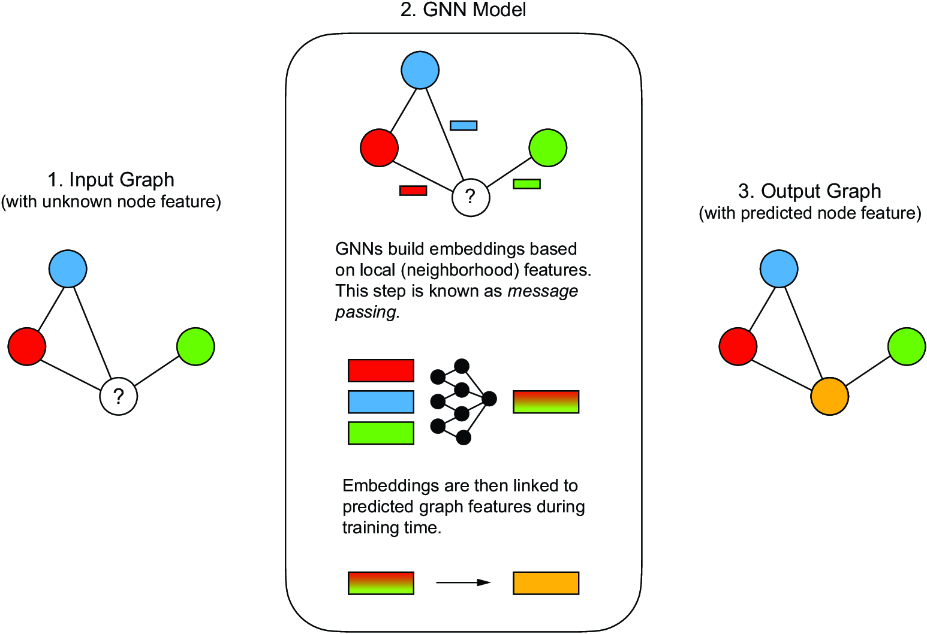

### Graph-based learning

 **Graph-Based Learning** is an umbrella branch of machine learning designed to directly process data structured as graphs rather than conventional flat vectors or grids. It focuses on training algorithms to discover patterns, make predictions, and generate representations by simultaneously exploiting both the individual attributes of entities (nodes) and the relational topologies connecting them (edges).

 **Input** data of graph-based learning: **Graph**  

#### What is a GNN?

GNNs combine graph-based learning with deep learning. This means that neural networks are used to build embeddings and process the relational data.

##### How GNNs work?

An input graph is passed to a GNN. The GNN then uses neural networks to transform graph features such as nodes or edges into nonlinear embeddings through a process known as message passing. These embeddings are then tuned to specific unknown properties using training data. After the GNN is trained, it can predict unknown features of a graph.
  

##### Permutation Invariance in GNNs

graph-based learning focuses on approaches that are **permutation invariant**. This means that the machine learning method is **uninfluenced by the ordering** of the graph representation. In concrete terms, it means that we can **shuffle the rows and columns of the adjacency** matrix without affecting our algorithm’s performance. Whenever we’re working with data that contains relational data, that is, has an adjacency matrix, then we want to use a machine learning method that is permutation invariant to make our method more general and efficient.  
Permutation invariances are a type of **inductive bias**, or an algorithm’s learning bias, and are powerful tools for designing machine learning algorithms.  
In graph-based learning we want to predict attributes or outcomes based on the **relationships** represented in the graph. By creating an adjacency matrix or defining graph edges and nodes based on the relationships in the dataset, we can transition from simple data analysis to more sophisticated graph-based learning methods.

