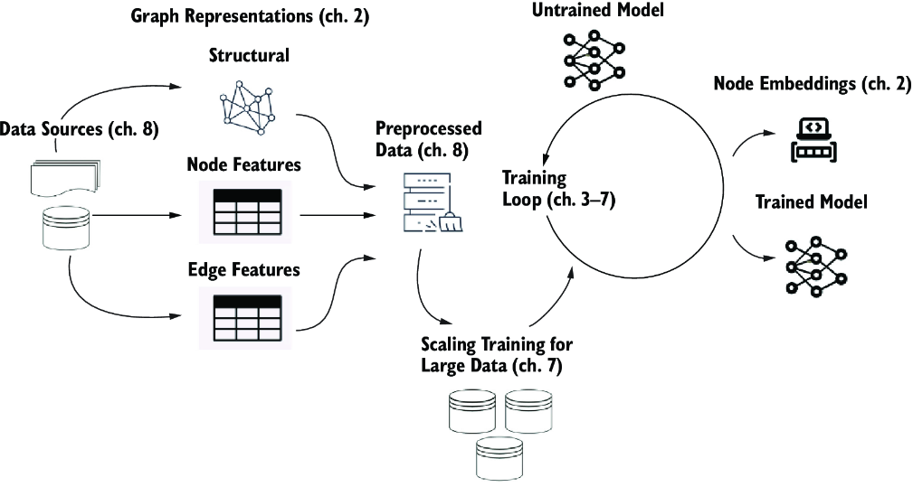
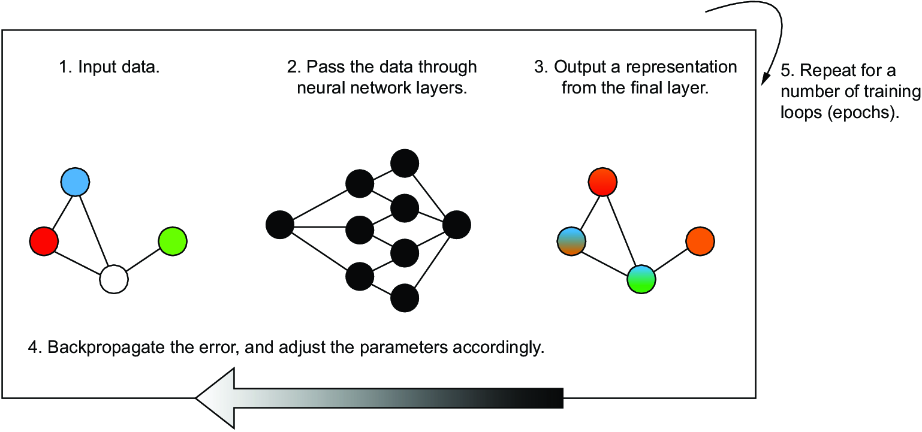
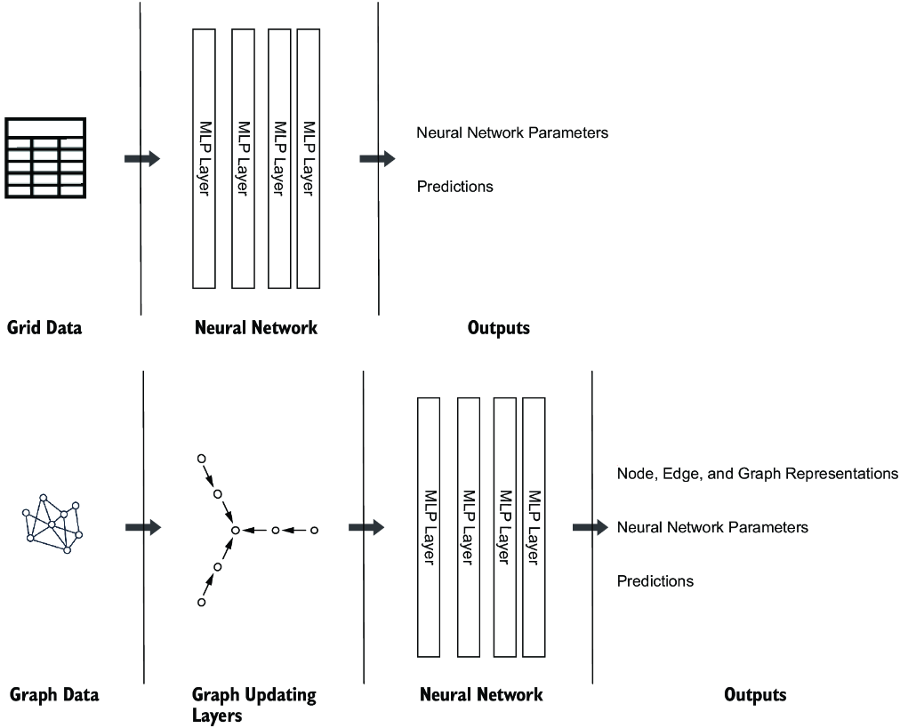
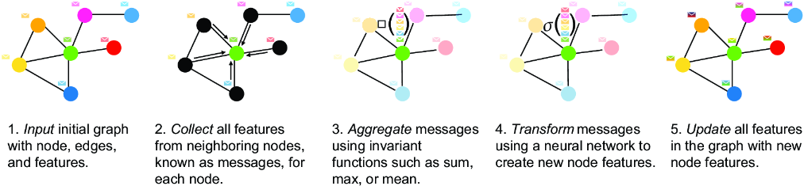

#### Understanding how GNNs operate

### Message Passing

Message passing is a central mechanism in GNNs that **enables nodes to communicate and share information** across a graph. This process allows GNNs to learn rich, informative representations of graph-structured data, which is essential for tasks such as node classification, link prediction, and graph-level prediction.  

> Each message passing layer consists of an **aggregation**, a **transformation**, and an **update** step.  

##### Message-Passing Process Steps

  

1. the Input of the initial graph:
    - Every node and edge have their own features
2. the **Collect** step:
    - Each node gathers information from its immediate neighbors.(*these pieces of information are referred to as "Messages"*) This step ensures that each node has access to the features of its neighbors, which are crucial for understanding the local graph structure.
3. the **Aggregate** step:
    - the collected messages from neighboring nodes are combined using an invariant function, such as sum, mean, or max. This aggregation consolidates the information from a node’s neighborhood into a single vector, capturing the most relevant details about its local environment.  

4. the **Transform** step:
    - the aggregated messages are processed by a neural network to produce a new representation for each node. This transformation allows the GNN to learn complex interactions and patterns within the graph by applying nonlinear functions to the aggregated information.

5. the **Update** step:
    - the features of each node in the graph are replaced or updated with these new representations. This completes one round of message passing, incorporating information from neighboring nodes to refine each node’s features.  

>> Each message-passing layer in a GNN allows nodes to gather information from nodes that are further away, or more “hops” away, in the graph. Repeating these steps over multiple layers enables the GNN to capture more complex dependencies and long-range interactions within the graph.  

>> By using message passing, GNNs efficiently encode the graph structure and data into useful representations for a variety of downstream tasks. Advanced architectures, such as those incorporating global attention or hierarchical message passing, further enhance the model’s ability to capture long-range dependencies across the graph, enabling more robust performance on diverse applications.

##### Conclusion

Message passing is a core mechanism of GNNs, which enables them to encode and exchange information across a graph’s structure, allowing for meaningful node, edge, and graph-level predictions. Each layer of a GNN represents one step of message passing, with various aggregation functions to combine messages effectively, providing insights and representations useful for machine learning tasks.
