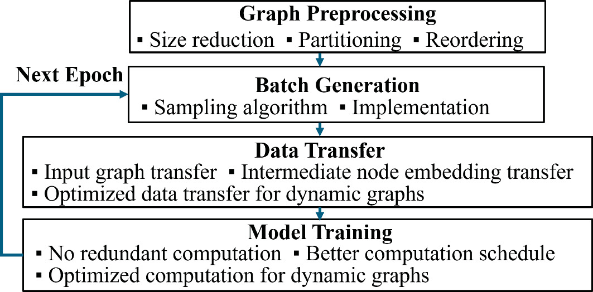

## Intoduction to GNN Training

### Graph Preprocessing

- Graph Size Reduction
- Graph Partitioning
- Graph Reordering

### Batch Generation

- Graph Sampling Algorithms
- Graph Sampling Implementations

### Data Transfer

- Transferring Input Graph Data
- Transferring Intermediate Node Embeddings

### Model Training

#### Training on Dynamic Graphs

- Optimized Data Transfer for Dynamic Graphs
- Optimized Computation for Dynamic Graphs
