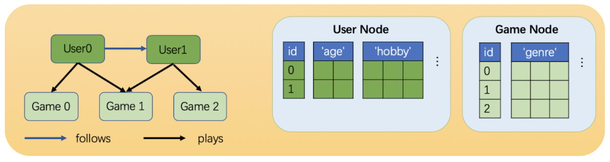

source: [https://www.dgl.ai/dgl_docs/guide](https://www.dgl.ai/dgl_docs/guide/graph-heterogeneous.html)

# Introdoction to Graphs: Part II

## Heterogeneous Graphs

A heterogeneous graph can have nodes and edges of different types. Nodes/Edges of different types have independent ID space and feature storage. For example in the figure below, the user and game node IDs both start from zero and they have different features.

A heterogeneous graph is specified with a series of graphs, one per relation. Each relation is a string triplet (`source node type`, `edge type`, `destination node type`). Since relations disambiguate the edge types, they can be called **canonical edge types**.

