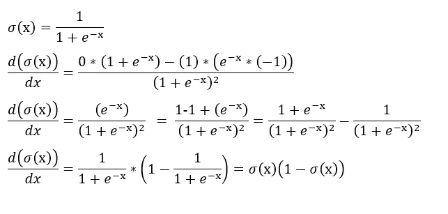
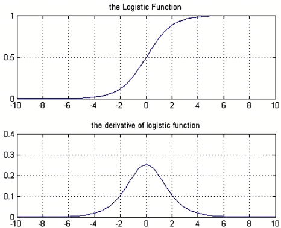

# Logistic Function, Softmax Function

## The derivative of logistic function

## The Relationship

**Linear Regression**:

- f(x) = wx + b
- Output: any real number (-∞, +∞)

**Logistic Regression**:
Logistic regression is simply applying the sigmoid function to a linear regression model.

- ŷ = σ(wx + b) = 1 / (1 + e^(-wx-b))
- Output: probability between (0, 1)

## Why This Works

The linear part (wx + b) produces a "logit" or "log-odds":

- When wx + b > 0 → probability > 0.5
- When wx + b < 0 → probability < 0.5
- When wx + b = 0 → probability = 0.5

The sigmoid function transforms this unbounded linear output into a valid probability.

## Extending to Multiple Features

For multiple features: **x = [x₁, x₂, ..., xₙ]**

**Logistic Regression**: ŷ = σ(w₁x₁ + w₂x₂ + ... + wₙxₙ + b) = 1 / (1 + e^(-w^T x - b))

## Extending to Multi-Class

For K classes, we extend this idea using softmax:

**Multi-class Logistic Regression** (also called Softmax Regression):

- Linear parts: zₖ = wₖᵀx + bₖ for each class k
- Softmax: ŷₖ = exp(zₖ) / Σⱼ exp(zⱼ)

So yes, your understanding is perfect! Logistic regression = sigmoid(linear model), making it a bridge between regression and classification.

## Definition of Logit

The **logit function** is the inverse of the sigmoid function:

**logit(p) = log(p / (1-p))**

where p is a probability between 0 and 1.

This is also called the **log-odds** because:

- **Odds** = p / (1-p)
- **Log-odds** = log(p / (1-p))

## The Relationship

In logistic regression, we model:

**log(p / (1-p)) = wx + b**

Or equivalently:

**p = sigmoid(wx + b) = 1 / (1 + e^(-wx-b))**

So the linear part (wx + b) represents the **log-odds** of the positive class.

## Why It's Called "Logit"

The term comes from "**log**istic un**it**" → "logit"

When we say "the logit" in machine learning, we typically mean:

- The **pre-activation value** (wx + b) before applying sigmoid/softmax
- This represents the log-odds of class membership

## Example

If p = 0.75 (75% probability):

- Odds = 0.75 / 0.25 = 3 (3-to-1 odds)
- Logit = log(3) ≈ 1.099

If we have wx + b = 1.099, then sigmoid(1.099) ≈ 0.75

## In Neural Networks

The term "logit" is commonly used for the **raw output before the final activation**:

- Neural network → logits (z) → sigmoid/softmax → probabilities (ŷ)

So "logit" refers to both the mathematical log-odds function AND the pre-activation values in classification models!

Logit function: Logit(p) = log(p / (1-p))
The logit function is the inverse of the logistic function. It takes a probability p (between 0 and 1) and transforms it into a value that can range from negative infinity to positive infinity.
Odds = p / (1-p)
Log-odds = log(p / (1-p))

Log-odds: The output of the logit function is the "log-odds," which is the natural logarithm of the odds. The odds are the ratio of the probability of an event happening to the probability of it not happening

A sigmoid(sigma+oid) function is any function with a characteristic S-shaped curve, while the logistic function is a specific mathematical formula for that curve, defined by \(\sigma (x)=\frac{1}{1+e^{-x}}\).
