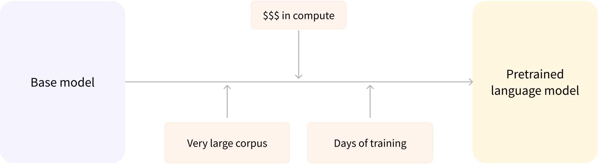
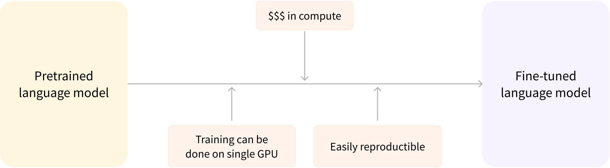

# How do Transformers work?

Source: [https://huggingface.co/learn/llm-course/chapter1/4?fw=pt](https://huggingface.co/learn/llm-course/chapter1/4?fw=pt)

### I. Self-Supervised Learning

Self-supervised learning is a type of training in which the objective is automatically computed from the inputs of the
model. That means that humans are not needed to label the data!

### II. Transfer Learning or fine-tuning

During this process, the model is fine-tuned in a supervised way — that is, using human-annotated labels — on a given
task.

examples of the task:

1. _causal language modeling:_ predicting the next word in a sentence having read the _n_ previous words. the output
   depends on the past and present inputs, but not the future ones.

2. _masked language modeling: the model predicts a masked word in the sentence_

**Pretraining**: training a model from scratch, the weights are randomly initialized, and the training starts without
any prior knowledge. Pretraining is usually done on very large amounts of data. Therefore, it requires a very large
corpus of data, and training can take up to several weeks.

**Fine-tuning**: is the training done **after** a model has been pretrained. To perform fine-tuning, you first acquire a
pretrained language model, then perform additional training with a dataset specific to your task.

The fine-tuning will only require a limited amount of data: the knowledge the pretrained model has acquired is
transferred, hence the term *transfer learning*.

### **Transformer architecture**

Two primitive blocks of a transformer model:

1. **Encoder**: Receives an input and builds a representation of it (its features). The model is optimized to acquire
   understanding from the input.
2. **Decoder**: Uses the encoder’s representation (features) along with other inputs to generate a target sequence. The
   model is optimized for generating outputs.

Each of these parts can be used independently, depending on the task:

- **Encoder-only models**: Good for tasks that require understanding of the input, such as sentence classification and
  named entity recognition.
- **Decoder-only models**: Good for generative tasks such as text generation.
- **Encoder-decoder models** or **sequence-to-sequence models**: Good for generative tasks that require an input, such
  as translation or summarization.

### **Attention layers**

An Attention layer will tell the model to pay specific attention to certain words in the sentence you passed it (and
more or less ignore the others) when dealing with the representation of each word.
In a natural language: a word by itself has a meaning, but that meaning is deeply affected by the context, which can be
any other word (or words) before or after the word being studied.

### **The original transformer architecture**

The Transformer architecture was originally designed for translation.

During training:
The encoder receives inputs (sentences) in a certain language, while the decoder receives the same sentences in the
desired target language.
In the encoder: the attention layers can use all the words in a sentence (since the translation of a given word can be
dependent on what is after as well as before it in the sentence).
The decoder: works sequentially and can only pay attention to the words in the sentence that it has already translated (
so, only the words before the word currently being generated).

For example, when we have predicted the first three words of the translated target, we give them to the decoder which
then uses all the inputs of the encoder to try to predict the fourth word.

To speed things up during training (when the model has access to target sentences), the decoder is fed the whole target,
but it is not allowed to use future words (if it had access to the word at position 2 when trying to predict the word at
position 2, the problem would not be very hard!). For instance, when trying to predict the fourth word, the attention
layer will only have access to the words in positions 1 to 3.

### **Architectures vs. Checkpoints**

**Architecture**: This is the skeleton of the model — the definition of each layer and each operation that happens
within the model.
**Checkpoints**: These are the weights that will be loaded in a given architecture.
**Model**: This is an umbrella term that isn’t as precise as “architecture” or “checkpoint”: it can mean both.
For example, BERT is an architecture while bert-base-cased, a set of weights trained by the Google team for the first
release of BERT, is a checkpoint. However, one can say “the BERT model” and “the bert-base-cased model.”
