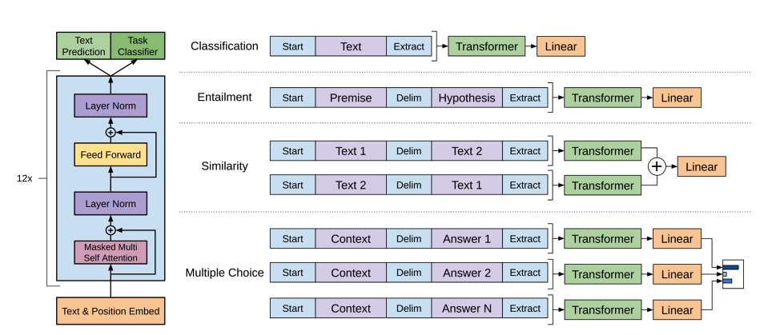

# How Transformers solve tasks

Source: [https://huggingface.co/learn/llm-course/chapter1/5?fw=pt](https://huggingface.co/learn/llm-course/chapter1/5?fw=pt)

Most tasks follow a similar pattern: Input data is processed through a model, and the output is interpreted for a specific task.
The differences lie in how the data is prepared, what model architecture variant is used, and how the output is processed.

**Language models** are trained to predict the probability of a word given the context of surrounding words.

Two main approaches for training a transformer model:

1. **Masked language modeling (MLM)** used by **encoder** models: It randomly masks some tokens in the input and trains the model to predict the original tokens based on the surrounding context. the model learn bidirectional context (looking at words both before and after the masked word).

2. **Causal language modeling (CLM)** used by **decoder** models: It predicts the **next token** based on all previous tokens in the sequence. It can only use context from the left (previous tokens) to predict the next token.

### Types of language models

1. **Encoder-only** models (like BERT): use a **bidirectional** approach to understand context from both directions. They’re best suited for tasks that require **deep understanding** of text.
   Usage: classification, named entity recognition, and question answering

2. **Decoder-only** models (like GPT, Llama) process text from **left to right** and are particularly good at **text generation** tasks.
   Usage: completing sentences, write essays, and generate code based on a prompt

3. **Encoder-decoder** models (like T5, BART) combine both approaches, using an **encoder to understand the input** and a **decoder to generate output**.
   Usage: sequence-to-sequence tasks like translation, summarization, and question answering

> Generally, tasks requiring bidirectional context use encoders, tasks generating text use decoders, and tasks converting one sequence to another use encoder-decoders.

> Language models are typically pretrained on large amounts of text data in a self-supervised manner (without human annotations), then fine-tuned on specific tasks. This approach, known as **transfer learning**, allows these models to adapt to many different NLP tasks with relatively small amounts of task-specific data.

### Text generation with GPT-2

GPT-2 uses [byte pair encoding (BPE)](https://huggingface.co/docs/transformers/tokenizer_summary#bytepair-encoding-bpe) to tokenize words and generate a token embedding.Positional encodings are added to the token embeddings to indicate the position of each token in the sequence. The input embeddings are passed through multiple decoder blocks to output some final hidden state. Within each decoder block, GPT-2 uses a masked self-attention layer which means GPT-2 can’t attend to future tokens. It is only allowed to attend to tokens on the left. This is different from BERT’s [`mask`] token because, in masked self-attention, an attention mask is used to set the score to 0 for future tokens.

The output from the decoder is passed to a language modeling head, which performs a linear transformation to convert the hidden states into logits. The label is the next token in the sequence, which are created by shifting the logits to the right by one. The cross-entropy loss is calculated between the shifted logits and the labels to output the next most likely token.

GPT-2’s pretraining objective is based entirely on [causal language modeling](https://huggingface.co/docs/transformers/tasks/language_modeling#causal-language-modeling), predicting the next word in a sequence. This makes GPT-2 especially good at tasks that involve generating text.

