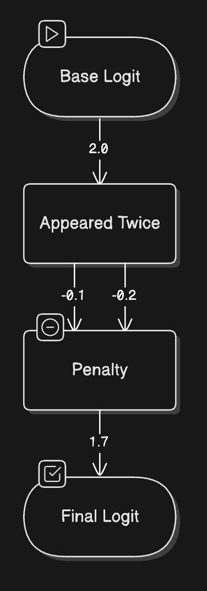
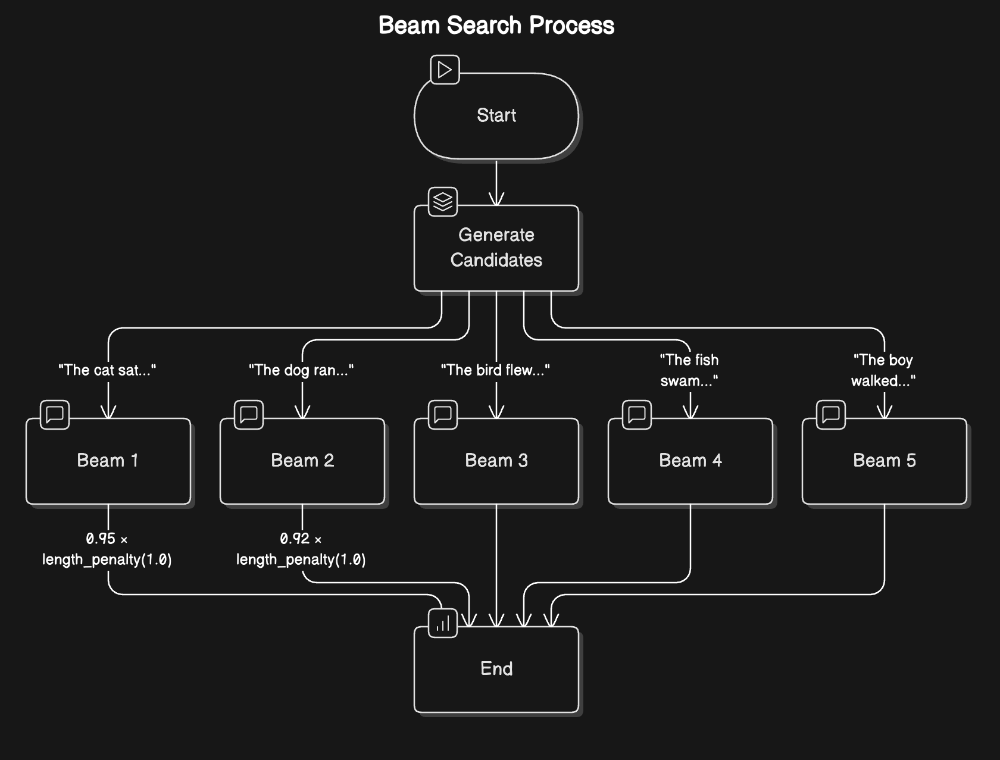

# Text Generation Inference with LLMs

Source: [https://huggingface.co/learn/llm-course/chapter1/8?fw=pt](https://huggingface.co/learn/llm-course/chapter1/8?fw=pt)

### Basic Definitions

###### Inference

The process of using a trained LLM to generate human-like text from a given input prompt.

###### Attention Mechanism

It gives LLMs their ability to understand context and generate coherent responses. When predicting the next word, not every word in a sentence carries equal weight. This ability to **focus on relevant information** is what we call attention.

###### Context Length

The **maximum** number of **tokens** (words or parts of words) that the LLM can **process at once**. Think of it as the size of the model’s **working memory**.

### The Two-Phase Inference Process

#### I. The Prefill Phase

- It’s where all the initial ingredients are processed and made ready.

1. **Tokenization**: Converting the input text into tokens (think of these as the basic building blocks the model understands)
2. **Embedding Conversion**: Transforming these tokens into numerical representations that capture their meaning
3. **Initial Processing**: Running these embeddings through the model’s neural networks to create a rich understanding of the context

> The prefill phase needs to process **all** input tokens at once. Think of it as reading and understanding an **entire paragraph** before starting to write a response. This phase is **compute-intensive**.

#### II. The Decode Phase

- This is where the actual text generation happens. The model generates one token at a time in what we call an *autoregressive* process (where each new token depends on all previous tokens).

All of these four steps happen for ***each new token***:

1. **Attention Computation**: Looking back at all previous tokens to understand context
2. **Probability Calculation**: Determining the likelihood of each possible next token
3. **Token Selection**: Choosing the next token based on these probabilities
4. **Continuation Check**: Deciding whether to continue or stop generation

> In the decode phase, the model needs to keep track of **all** previously generated tokens and their relationships. This phase is **memory-intensive**.

<iframe src="https://agents-course-decoding-visualizer.hf.space" frameborder="0" width="1000" height="600"></iframe>

### Sampling Strategies

#### Token Selection

> How do we turn raw probabilities (called logits) for every word into actual choices?

1. **Raw Logits**: Think of these as the model’s initial gut feelings about each possible next word
2. **Temperature Control**: Like a creativity dial - higher settings (>1.0) make choices more random and creative, lower settings (<1.0) make them more focused and deterministic
3. **Top-p (Nucleus) Sampling**: Instead of considering all possible words, we only look at the most likely ones that add up to our chosen probability threshold (e.g., top 90%)
4. **Top-k Filtering**: An alternative approach where we only consider the k most likely next words

#### Managing Repetition: Keeping Output Fresh

> How to prevent the model from repeating itself?

1. **Repetition Penalty**: A fixed penalty applied to any token that has appeared before, regardless of how often. This helps prevent the model from reusing the same words.
2. **Frequency Penalty**: A scaling penalty that increases based on how often a token has been used. The more a word appears, the less likely it is to be chosen again.

#### Controlling Generation Length: Setting Boundaries

> How to control the length of the generated text?

1. **Token Limits**: Setting minimum and maximum token counts
2. **Stop Sequences**: Defining specific patterns that signal the end of generation
3. **End-of-Sequence Detection**: Letting the model naturally conclude its response

#### Beam Search: Looking Ahead for Better Coherence

Beam search takes a more **holistic** approach. Instead of committing to a single choice at each step, it explores **multiple** possible paths simultaneously - like a chess player thinking several moves ahead.

1. At each step, maintain multiple candidate sequences (typically 5-10)
2. For each candidate, compute probabilities for the next token
3. Keep only the most promising combinations of sequences and next tokens
4. Continue this process until reaching the desired length or stop condition
5. Select the sequence with the highest overall probability

<iframe src="https://agents-course-beam-search-visualizer.hf.space" frameborder="0" width="1000" height="600"></iframe>

### Practical Challenges

#### Performance Metrics

> The critical metrics that shape implementation decisions:

1. **Time to First Token (TTFT)**: How quickly can you get the first response? This is crucial for user experience and is primarily affected by the prefill phase.
2. **Time Per Output Token (TPOT)**: How fast can you generate subsequent tokens? This determines the overall generation speed.
3. **Throughput**: How many requests can you handle simultaneously? This affects scaling and cost efficiency.
4. **VRAM Usage**: How much GPU memory do you need? This often becomes the primary constraint in real-world applications.

#### Context Length Management

> Longer contexts come with substantial costs:

- **Memory Usage**: Grows quadratically with context length
- **Processing Speed**: Decreases linearly with longer contexts
- **Resource Allocation**: Requires careful balancing of VRAM usage

Input Text (Raw)
 
→
 
Tokenized Input

 

Context Window (e.g., 4K tokens)
                

 

 

 

 

Memory Usage ∝ Length²

 

Processing Time ∝ Length

#### The KV (Key-Value) Cache Optimization

> The KV (Key-Value) caching technique improves inference speed by storing and reusing intermediate calculations. But the trade-off is additional memory usage.

- Reduces repeated calculations
- Improves generation speed
- Makes long-context generation practical
