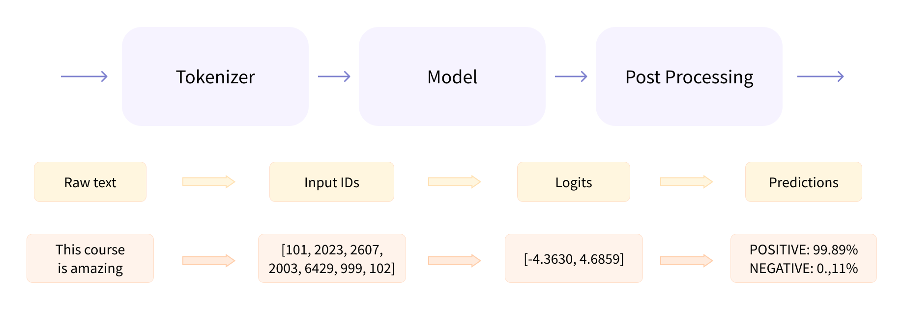
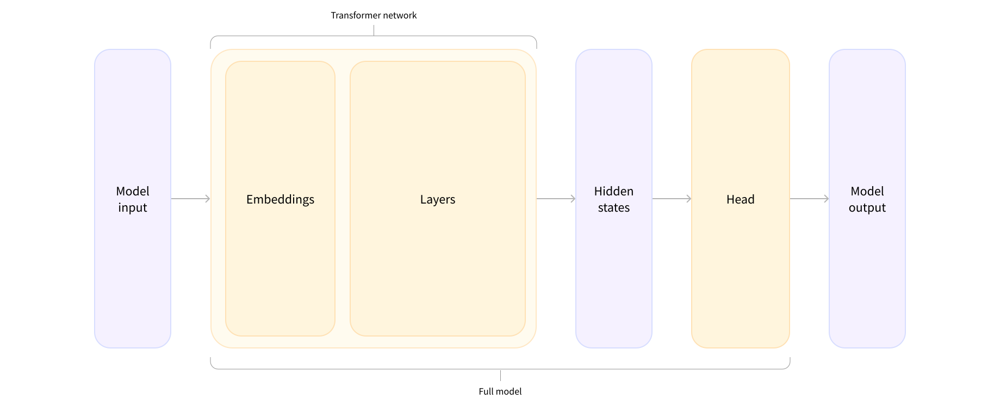

### Preprocessing with a tokenizer

> Preprocessing needs to be done in exactly the same way as when the model was pretrained.

###### Tokenizer

A tokenizer is responsible for:

- Splitting the input into words, subwords, or symbols (like punctuation) that are called tokens
- Mapping each token to an integer
- Adding additional inputs that may be useful to the model


```python
from transformers import AutoTokenizer

checkpoint = "distilbert-base-uncased-finetuned-sst-2-english"
tokenizer = AutoTokenizer.from_pretrained(checkpoint)

```


